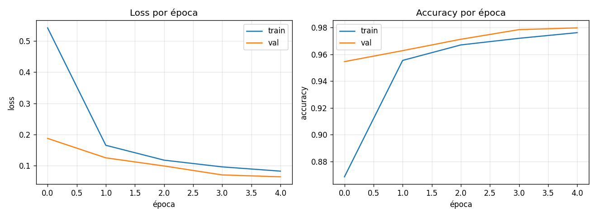
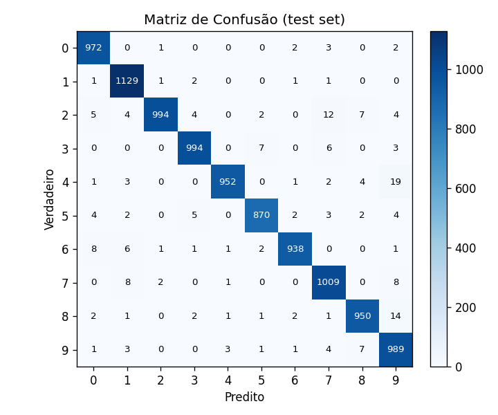

# Desafio Edge AI — MNIST (Relatório Técnico)

Classificador de dígitos manuscritos (MNIST) com uma CNN propositalmente enxuta, treinada em CPU e otimizada para execução em dispositivos *Edge* via TensorFlow Lite. Este README documenta as decisões de projeto, métricas obtidas e trade-offs entre as diferentes técnicas de quantização exploradas.

---

## 1. Identificação

- **Nome:** João Isaac Alves Farias
- **Processo:** Intensivo Maker | AI

---

## 2. Visão geral do pipeline

A geração dos artefatos é totalmente automatizada por dois scripts:

| Script | Entrada | Saída principal |
|---|---|---|
| [`train_model.py`](train_model.py) | dataset MNIST (TF Datasets) | `model.h5`, `artifacts/model.keras`, `artifacts/saved_model/`, métricas e gráficos |
| [`optimize_model.py`](optimize_model.py) | `model.h5` | `model.tflite` (INT8) + 3 variantes em `artifacts/tflite/` |

---

## 3. Arquitetura da CNN

A rede tem apenas 6 442 parâmetros (≈ 25 KB de pesos em FP32):

| # | Camada | Saída | Parâmetros | Justificativa |
|---|---|---|---:|---|
| 1 | `Conv2D(8, 3x3, same, ReLU)` | 28×28×8 | 80 | Filtros pequenos extraem traços locais com baixíssimo custo |
| 2 | `BatchNormalization` | 28×28×8 | 32 | Estabiliza o gradiente em apenas 5 épocas |
| 3 | `MaxPooling2D(2)` | 14×14×8 | 0 | Reduz resolução sem custo paramétrico |
| 4 | `Conv2D(16, 3x3, same, ReLU)` | 14×14×16 | 1 168 | Dobrar canais quando reduzimos espaço (regra clássica) |
| 5 | `BatchNormalization` | 14×14×16 | 64 | — |
| 6 | `MaxPooling2D(2)` | 7×7×16 | 0 | — |
| 7 | `Conv2D(32, 3x3, same, ReLU)` | 7×7×32 | 4 640 | Última extração de features |
| 8 | `BatchNormalization` | 7×7×32 | 128 | — |
| 9 | `GlobalAveragePooling2D` | 32 | 0 | **Substitui `Flatten + Dense(64)`** — elimina ~80% dos params da versão anterior |
| 10 | `Dropout(0.25)` | 32 | 0 | Regularização leve |
| 11 | `Dense(10, softmax)` | 10 | 330 | Classificador linear sobre features comprimidas |

**Decisões de projeto e trade-offs:**

- **`GlobalAveragePooling2D` no lugar de `Flatten + Dense(64)`** — a versão original do desafio gerava um `.h5` de ~1.16 MB porque o `Flatten` produzia 576 features que alimentavam um `Dense(64)`, custando ~37 mil parâmetros só nessa transição. Trocando por GAP, perdemos pouca capacidade representativa em MNIST (problema simples) e ganhamos um modelo 8,5× menor.
- **Filtros pequenos (8 → 16 → 32)** — em vez dos 32→64→64 originais, suficientes para MNIST (10 classes em imagens 28×28 com baixa variação).
- **`BatchNormalization` em todos os blocos conv** — compensa a limitação de épocas, acelerando convergência. Em quantização INT8 a BN é fundida ao kernel, então não custa nada em inferência.
- **`Dropout(0.25)` antes do classificador** — regularização suficiente para um modelo pequeno; valores maiores começariam a sub-treinar em apenas 5 épocas.
- **Sem `Dense` intermediário largo** — qualquer `Dense(64)` ou `Dense(128)` adicional inflaria o modelo e seria o primeiro alvo de pruning numa otimização real.

Total: **6 442 parâmetros** | **`model.h5` ≈ 137 KB**.

---

## 4. Bibliotecas utilizadas

Versões fixadas em [`requirements.txt`](requirements.txt):

| Biblioteca | Versão | Uso |
|---|---|---|
| `tensorflow` | ≥ 2.16 | Treino, salvamento `.h5`/`.keras`/SavedModel, conversor TFLite, `Interpreter` |
| `numpy` | * | Manipulação de tensores e medições de latência |
| `scikit-learn` | * | `precision_score`, `recall_score`, `f1_score`, `confusion_matrix`, `classification_report` |
| `matplotlib` | * | Curvas de treino e visualização da matriz de confusão |

---

## 5. Métricas e evidências

Treino executado em CPU (`CUDA_VISIBLE_DEVICES=-1`), 5 épocas, batch 64, `seed=42`.

### 5.1 Resultados no test set (10 000 amostras)

| Métrica | Valor |
|---|---:|
| Accuracy | **0.9797** |
| Precision (macro) | 0.9801 |
| Recall (macro) | 0.9795 |
| F1-score (macro) | 0.9797 |
| Test loss | 0.0645 |
| Latência Keras (CPU, single-image) | 68.7 ms (mean) / 76.8 ms (p95) |
| Tempo total de treino | ~102 s |

> O relatório completo por classe está em [`artifacts/metrics.json`](artifacts/metrics.json).

### 5.2 Curvas de treinamento



Treino e validação caem juntos, sem overfitting visível em 5 épocas, o que indica que o modelo está bem dimensionado para o problema (nem sub nem super-parametrizado).

### 5.3 Matriz de confusão



A diagonal concentra a quase totalidade das predições. As confusões mais frequentes (`4↔9`, `8↔9`, `2↔7`) são as historicamente esperadas em MNIST devido à similaridade visual dos dígitos — não há sinal de viés sistemático contra alguma classe.

---

## 6. Conversão e otimização para TFLite

`optimize_model.py` converte o modelo treinado para **quatro variantes** TFLite, avaliando cada uma com o `tf.lite.Interpreter` no test set inteiro e medindo latência single-image (n=500, após warmup):

| Variante | Técnica | Tamanho (KB) | Acurácia | Δ vs FP32 | Mean (ms) | p95 (ms) | I/O |
|---|---|---:|---:|---:|---:|---:|---|
| `fp32` | Sem otimização (baseline) | 30.50 (100%) | 0.9797 | +0.00 pp | 0.039 | 0.055 | float32 |
| `dynamic` | Dynamic Range Quantization | 14.27 (47%) | 0.9800 | +0.03 pp | 0.030 | 0.041 | float32 |
| `float16` | Float16 Quantization | 20.45 (67%) | 0.9797 | +0.00 pp | 0.042 | 0.079 | float32 |
| `int8` | **Full Integer (INT8)** | **14.56 (48%)** | **0.9749** | **-0.48 pp** | **0.040** | **0.057** | **int8** |

> Tabela viva em [`artifacts/tflite/comparison.md`](artifacts/tflite/comparison.md) e
> [`comparison.json`](artifacts/tflite/comparison.json).

### 6.1 O que cada técnica faz

- **Dynamic Range Quantization** — apenas os pesos viram INT8; ativações permanecem FP32 e são quantizadas/desquantizadas em runtime. Não exige dataset representativo. Indicada quando se busca otimizar desempenho e tamanho sem perder compatibilidade com CPUs convencionais.
- **Float16 Quantization** — pesos passam de FP32 para FP16 (metade do tamanho), preservando precisão. Indicada para dispositivos com aceleração para operações FP16,como smartphones e embarcados recentes, já que o TFLite pode direcionar essas operações para o hardware gráfico. Também é útil quando se deseja uma redução de tamanho sem perda de acurácia.
- **Full Integer Quantization (INT8)** — toda a inferência (pesos e ativações) roda em INT8. Requer um `representative_dataset` (~200 amostras de MNIST) para calibrar as escalas das ativações. É geralmente a abordagem recomendada para microcontroladores, NPUs e Coral EdgeTPU, sendo tipicamente a mais rápida em hardware com aceleração inteira, mas a escolha pode variar dependendo das restrições e do suporte do hardware envolvido.

### 6.2 Por que INT8 foi escolhido como `model.tflite` final

A variante `int8` é a entregue na raiz porque:

1. **É a opção recomendada Edge** — só ela roda em MCUs (TFLM), Coral, NPUs e DSPs móveis; as demais ainda exigem suporte a ponto flutuante.
2. **Tamanho:** 14.56 KB — **9,4× menor que o `model.h5`** (136.64 KB) e ~95% menor que o modelo original do template (~1.16 MB).
3. **Custo de acurácia aceitável:** -0.48 pp (97.97% → 97.49%), bem abaixo do limiar típico de 1 pp considerado aceitável em produção Edge.

> Observação: a `dynamic` aparece com latência levemente menor neste benchmark CPU
> porque `tf.lite.Interpreter` em CPU não tem aceleração INT8 dedicada. Em hardware
> alvo de Edge (Cortex-M, EdgeTPU, NPUs móveis) o cenário se inverte: INT8 é
> tipicamente 2–4× mais rápido.

### 6.3 Cuidados de implementação para INT8

- `inference_input_type=tf.int8` e `inference_output_type=tf.int8` garantem que a fronteira do modelo já é inteira (sem custo de conversão FP↔INT no runtime).
- A entrada precisa ser **pré-processada** usando os parâmetros de quantização (`scale`, `zero_point`) lidos do `Interpreter`. O script faz isso automaticamente em `prepare_input()` dentro de [`optimize_model.py`](optimize_model.py).
- O `representative_dataset` usa amostragem aleatória determinística (seed fixa) para reprodutibilidade da calibração.

---

## 7. Trade-offs gerais

| Eixo | Observação |
|---|---|
| **Tamanho × Acurácia** | A queda de 1.16 MB → 14.56 KB (≈ -98.7%) custou apenas 0.48 pp de acurácia. Para MNIST esse trade é claramente vantajoso. |
| **Acurácia × Velocidade** | Float16 preserva 100% da acurácia e é 33% menor; INT8 perde 0.48 pp e fica 53% menor. Em CPU PC a diferença de latência é ruído; em Edge real, INT8 ganha. |
| **Simplicidade × Resultado** | Dynamic Range é a técnica mais simples (sem dataset de calibração) e em problemas fáceis como MNIST chega a empatar com FP32. Em problemas mais complexos, a vantagem do INT8 calibrado cresce. |
| **Modelo × Quantização** | Optar por uma arquitetura naturalmente enxuta (GAP, filtros pequenos) é mais barato em acurácia do que treinar uma rede grande e depois prunar/quantizar agressivamente. |

---

## 8. Como executar

Pré-requisitos: Python 3.10/3.11 e `pip`.

```bash
pip install -r requirements.txt
python train_model.py        # gera model.h5 + artefatos em artifacts/
python optimize_model.py     # gera model.tflite + variantes em artifacts/tflite/
```

Estrutura de artefatos gerada:

```
.
├── model.h5                       # Keras .h5 (raiz, validado pelo CI)
├── model.tflite                   # TFLite INT8 (raiz, validado pelo CI)
└── artifacts/
    ├── model.keras                # Formato nativo Keras 3
    ├── saved_model/               # TF SavedModel (servir / converter)
    ├── metrics.json               # Hyperparams + métricas + matriz confusão
    ├── training_curves.png
    ├── confusion_matrix.png
    └── tflite/
        ├── fp32.tflite
        ├── dynamic.tflite
        ├── float16.tflite
        ├── int8.tflite
        ├── comparison.md
        └── comparison.json
```

O CI ([`.github/workflows/ci.yml`](.github/workflows/ci.yml)) executa exatamente essa sequência em ambiente limpo e exige que `model.h5` e `model.tflite` existam ao final.

---

## 9. Limitações e próximos passos

- **5 épocas** é o limite do CI. Com 15–20 épocas e *learning rate schedule* a acurácia chegaria facilmente a >99%, mas isso violaria as restrições do desafio.
- **Não há *data augmentation*** — para MNIST faz pouca diferença, mas seria o primeiro passo se quiséssemos generalizar para quaisquer dígitos manuscritos.
- **Pruning estruturado** (TensorFlow Model Optimization Toolkit) e **Quantization Aware Training (QAT)** poderiam recuperar a perda de 0.48 pp do INT8 e abrir caminho para INT4/binarização — direções óbvias para um próximo ciclo.
- **Knowledge distillation** a partir de uma rede maior poderia melhorar a acurácia desta CNN enxuta sem aumentar seu tamanho.
- **Deploy real** em Coral EdgeTPU exigiria um passo extra de compilação (`edgetpu_compiler`), que não foi incluído por estar fora do escopo do CI.
